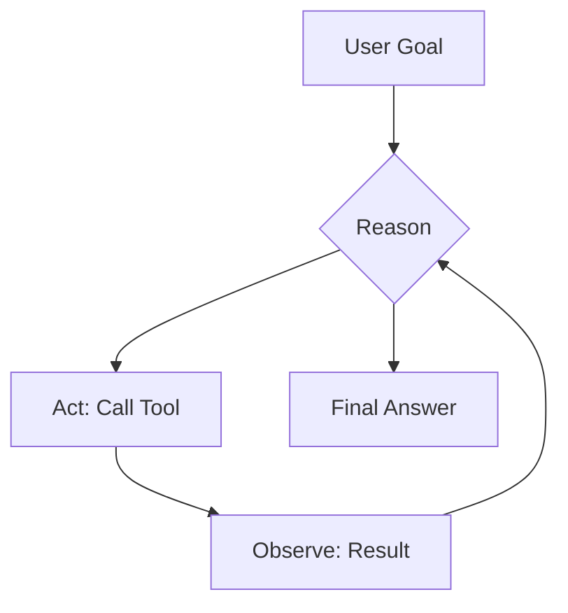
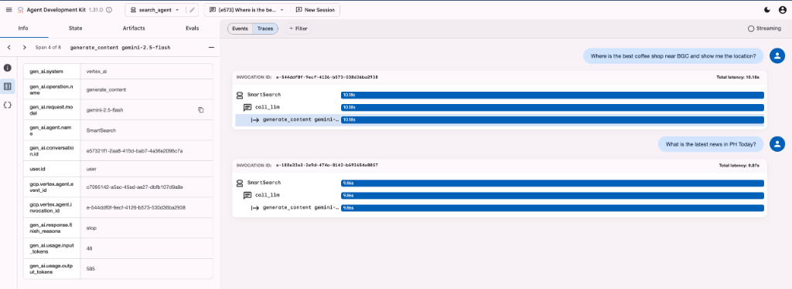
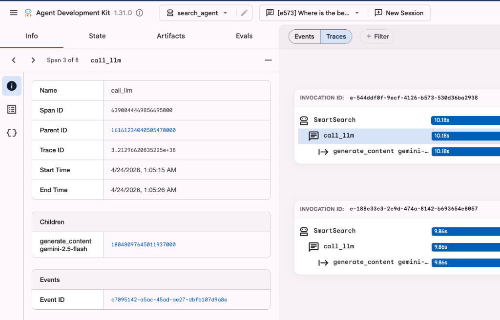
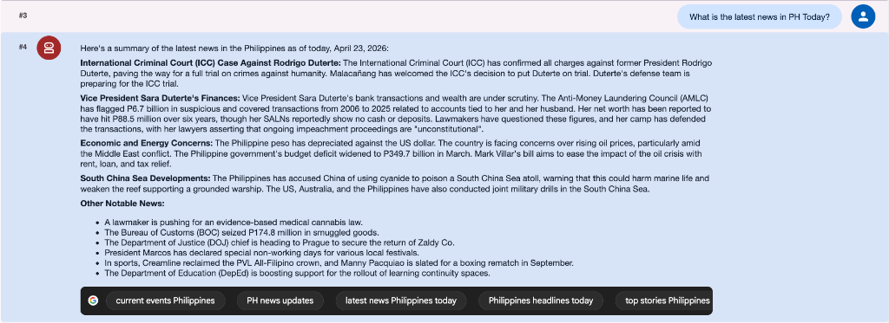
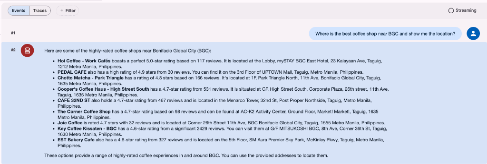
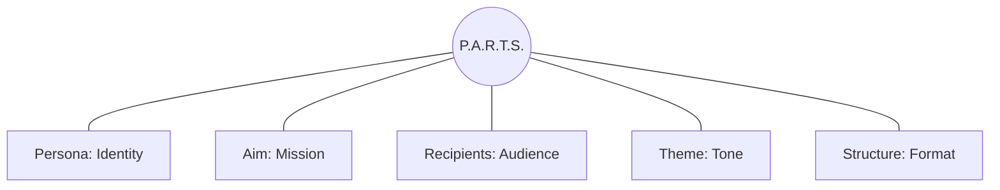

!!! important
    **Disclaimer** – This tutorial uses **Google ADK v1.31.0**.

# Google ADK: Build Your First Agent on Gemini Enterprise Agent Platform

<div class="toc-grid">
  <a href="#section-1-what-is-google-adk" class="toc-card">
    <div class="toc-card-header">
      <span class="toc-card-number">1</span>
      <span>What is Google ADK?</span>
    </div>
    <div class="toc-card-desc">Introduction to the Google Agent Development Kit and the rebranding to Gemini Enterprise Agent Platform.</div>
  </a>
  
  <a href="#section-2-prerequisites" class="toc-card">
    <div class="toc-card-header">
      <span class="toc-card-number">2</span>
      <span>Prerequisites</span>
    </div>
    <div class="toc-card-desc">System requirements, installing uv, authenticating with Google Cloud, and enabling the required APIs.</div>
  </a>
  
  <a href="#section-3-what-is-an-ai-agent" class="toc-card">
    <div class="toc-card-header">
      <span class="toc-card-number">3</span>
      <span>What is an AI Agent?</span>
    </div>
    <div class="toc-card-desc">Understanding the core concepts of agents, tools, and the reasoning-action loop (ReAct model).</div>
  </a>
  
  <a href="#section-4-initialize-your-project" class="toc-card">
    <div class="toc-card-header">
      <span class="toc-card-number">4</span>
      <span>Initialize Your Project</span>
    </div>
    <div class="toc-card-desc">Step-by-step instructions to create your project and initialize your first agent using `adk create`.</div>
  </a>
  
  <a href="#section-5-how-to-test-your-agent-using-adk-web" class="toc-card">
    <div class="toc-card-header">
      <span class="toc-card-number">5</span>
      <span>Test Using ADK Web</span>
    </div>
    <div class="toc-card-desc">How to run, use, and debug your agent using the visual traces and metrics in the ADK Web Dashboard.</div>
  </a>
  
  <a href="#section-6-grounding-with-tools" class="toc-card">
    <div class="toc-card-header">
      <span class="toc-card-number">6</span>
      <span>Grounding with Tools</span>
    </div>
    <div class="toc-card-desc">Integrating live news search and maps location intelligence to provide accurate, real-time responses.</div>
  </a>
  
  <a href="#section-7-the-parts-prompt-framework" class="toc-card">
    <div class="toc-card-header">
      <span class="toc-card-number">7</span>
      <span>P.A.R.T.S. Prompt Framework</span>
    </div>
    <div class="toc-card-desc">Applying structured prompt engineering rules (Persona, Aim, Recipients, Theme, Structure).</div>
  </a>
</div>

## Section 1 – What is Google ADK?
The **Google Agent Development Kit (ADK)** is an open-source, code-first developer framework designed to build, test, debug, and deploy sophisticated AI agents and multi-agent systems. 

Key capabilities of the ADK include:
* **First-Class Gemini Integration**: Native support for Gemini models (e.g., Gemini 2.5 Flash and Pro).
* **Standardized Tool Connection**: Integrates with external tools, APIs, and data sources via the Model Context Protocol (MCP).
* **Multi-Agent Orchestration**: Supports predictable, pipelined, or dynamic LLM-driven routing, allowing agents to collaborate and delegate using the Agent-to-Agent (A2A) protocol.

In production, agents built with the ADK run on the managed **Gemini Enterprise Agent Platform(formerly Vertex AI)**, which provides enterprise-grade runtime features including persistent state, secure sandboxes, logging, and performance telemetry.

[Read the Rebranding Announcement](https://cloud.google.com/blog/products/ai-machine-learning/introducing-gemini-enterprise-agent-platform){:target="_blank"}

## Section 2 – Prerequisites
1. **Python 3.12 or newer** – required runtime.
2. **uv** – package manager. Install with:

    ```bash
    curl -LsSf https://astral.sh/uv/install.sh | sh
    ```

    Verify: `uv --version`.

    !!! info "Why use uv?"
        **uv** is an extremely fast Python package and project manager written in Rust. We use it in this guide because:
        
        * **Performance**: It is 10–100x faster than standard tools like `pip` or `pip-tools`.
        * **Simplicity**: It handles Python installation, virtual environment management, and dependency locking in a single, unified tool.
        * **Consistency**: It automatically manages and locks package versions (`uv.lock`), ensuring your agent project runs identically on every developer's machine and in production.
        * **No Environment Activation Friction**: You don't need to manually activate virtual environments (e.g. `source .venv/bin/activate`). Prefixing commands with `uv run <command>` automatically resolves dependencies and runs your script inside the project's isolated runtime environment.

3. **Google Cloud SDK (`gcloud`)** – install from <https://cloud.google.com/sdk/docs/install> if you don’t have it. Then authenticate:

    ```bash
    gcloud auth application-default login
    ```

    !!! info "What does this command do?"
        Running `gcloud auth application-default login` opens your browser to log in with your Google account, generating **Application Default Credentials (ADC)** stored locally on your machine.
        
        When the Google ADK runs, it automatically retrieves these credentials to authenticate calls to Gemini and the Vertex AI APIs. This allows you to build and test agents locally without having to hardcode API keys or manage service account secrets.

4. **Google Cloud Project ID** – needed to route requests to Gemini.
    - **Option A (Console)** – Open the [Google Cloud Console](https://console.cloud.google.com/), click the project dropdown, and copy the **Project ID**.
    - **Option B (Terminal)** – Run `gcloud config get-value project`.

5. **Enable Gemini Enterprise Agent Platform API** – turn on the AI service in your Google Cloud Project.
    - **Option A (Console)** – Go to the API Library in the Google Cloud Console, search for "Vertex AI API", and click **Enable**.
    - **Option B (Terminal)** – Run:
        ```bash
        gcloud services enable aiplatform.googleapis.com
        ```

## Section 3 – What is an AI Agent?
An AI agent is a program that uses a language model to decide when to call external tools (like search APIs, maps, or databases) to complete a task.

### The ReAct Loop

1. **Reason** – Decide what to do next.
2. **Act** – Call a tool (like Google Search).
3. **Observe** – Read the tool's output and decide if the task is complete.

## Section 4 – Initialize Your Project
```bash
mkdir my-agent && cd my-agent
uv init                       # Initialize a new Python project structure
uv add google-adk==1.31.0     # Add the Google ADK dependency to your project
uv run adk create my_first_agent  # Scaffold the default agent files and settings
```

### Terminal interaction
When `adk create` runs, you’ll see:

```bash
Choose model: 1 (gemini-2.5-flash)
Choose backend: 2 (Gemini Enterprise Agent Platform)
Enter Project ID: # your‑project‑id
Enter Region: # press Enter for us-central1
```

This scaffolding process creates the main script file for your agent, named `agent.py`, in your project directory. This is the script you will configure and run in the subsequent sections of this guide.

## Section 5 – How to Test Your Agent Using ADK Web

The ADK Web Dashboard provides a visual playground to interact with your agent, inspect intermediate logic, and debug performance bottlenecks.

### 1. Launching the Dashboard
Run the following command in your terminal:
```bash
uv run adk web
```
Once started, open your browser and navigate to **<http://localhost:8080>**.

### 2. Running Test Queries
Start with simple test queries to verify your agent's behavior:
* **The Warm-up:** Ask a simple fact-based question: *“What is the capital of Philippines?”*
* **The Grounding Challenge:** Ask for real-time information: *“What is the latest news in the Philippines today?”* (This forces the agent to decide whether to call a search tool).

### 3. ADK Web Features

* **Trace Panel:** Visualizes the execution timeline of your agent's reasoning loop (e.g., `SmartSearch` → `call_llm` → `generate_content`). Look for the horizontal blue bars; they indicate how much latency each individual step contributes to the total run.
* **Telemetry and Stats:** The sidebar details key metrics for every query execution:
    * `gen_ai.usage.output_tokens` – Total generated output tokens.
    * `gen_ai.request.model` – The active LLM configuration (`gemini-2.5-flash`).
    * **Latency** – The round-trip time for the request.
* **Events vs. Traces:** 
    * **Events** capture the raw JSON payload exchanged with the backend.
    * **Traces** profile the structural timeline, showing call hierarchies and step-by-step execution metrics.
* **Session Control:** Click the **New Session** button at the top of the chat panel to wipe the conversational history clean and reset memory for a fresh conversation.



* ** Analyzing Agent Traces
Drill down into individual model calls and tool executions to debug prompt inputs, response outputs, and internal parameters.



## Section 6 – Grounding with Tools
Tools let the agent pull in real-time information. Grounding ensures responses are accurate and up-to-date rather than based only on static model weights.

To understand why tool integration is crucial, it is helpful to look at two core concepts:

<div class="grid cards" markdown>

*   <span class="concept-title concept-hallucination">⚠️ Hallucination</span>
    
    Occurs when an AI provides factually incorrect information with confidence. LLMs are prediction engines that may generate logical-sounding but false responses when they lack specific facts.

*   <span class="concept-title concept-grounding">⚓ Grounding</span>
    
    Connects AI reasoning to a verifiable source of truth to reduce hallucinations.

</div>

### Example: Search & Maps
Update `agent.py`:

```python
from google.adk import models, agents, tools

root_agent = agents.LlmAgent(
    name="SmartSearch",
    model=models.Gemini(model="gemini-2.5-flash"),
    tools=[
        tools.google_search,         # Live news
        tools.google_maps_grounding  # Location intelligence
    ],
    instruction="You are an expert research and location assistant. Use tools to verify all facts and find places."
)
```
*Note:* You don't need a separate API key for Google Search. The Gemini Enterprise Agent Platform routes these requests automatically.




## Section 7 – The P.A.R.T.S. Prompt Framework

The **P.A.R.T.S.** framework helps you write structured system instructions and prompts that produce consistent, high-quality agent behavior. By defining each element explicitly, you apply prompt engineering best practices to reduce ambiguity and enforce clear formatting constraints.



* **Persona (P)** – Who the agent is (e.g., its role or identity).
* **Aim (A)** – What the agent must accomplish (its task or mission).
* **Recipients (R)** – Who will consume the output.
* **Theme (T)** – The desired tone, style, or guidelines.
* **Structure (S)** – The exact output format or layout.

### Why it matters – before vs. after

We can see P.A.R.T.S. in action by refining the basic agent instruction from Section 6:

* **Without P.A.R.T.S. (Generic Instruction)**:
    * **Instruction:** *"You are an expert research and location assistant. Use tools to verify all facts and find places."*
    * **Analysis:** While it specifies the role (Persona) and the core task (Aim), it lacks clear constraints on output formatting, tone, and audience context, leaving the agent's behavior up to generic defaults.

* **With P.A.R.T.S. (Consolidated Instruction)**:
    Rather than managing disjointed prompt details, you merge the components directly into a single, cohesive system instruction block:
    
    ```python
    instruction="""
    You are an expert research and location assistant equipped with search and maps tools [P]. 
    Verify user assertions using real-time search and find precise geographical locations using maps grounding [A] 
    for general users [R]. 
    Keep your response objective, neutral, and evidence-based [T]. 
    Structure your output using Markdown headers, status-flagged bullet points, and key-value listings [S].
    """
    ```

---

## What's Next?
Now that you have built a basic grounded agent, you can try customizing it:

1. Edit `agent.py` and change the `instruction` to a different persona (for example, a pirate or historical figure).
2. Restart the web UI and ask the same question to see how the response tone changes.


---

!!! info "About the Creator"
    This guide was built and is maintained by **Renzi Vidal** for [Data Engineering Pilipinas](https://www.facebook.com/groups/1225639754738756/){:target="_blank"} AI Study Group 2026. If you found this tutorial helpful, join our community and let's connect on [LinkedIn](https://www.linkedin.com/in/ultrenz-vidal/){:target="_blank"}!
